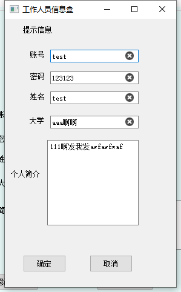

# 数据库课程设计

> python PyQt5 QtDesigner pymysql

### 前言

* 通讯录记账系统，可上传头像

###  配置

#### 平台

* Python3.X
* PyQt5
* QtDesigner
* pymysql
* mysql

### 如何启动

1. 在 mysql数据库中创建 `mail_list_sys` 数据库
```
create database mail_list_sys;
```

2. 安装第三方包
```
pip install -r requirements.txt
```

3. 同步表结构
```
在数据库中执行 mls.sql
```

4. 启动

注意，这里要修改 `db_connect.py` 文件中的数据库地址!!!
```
python run.py
```


### 系统主要功能界面介绍

* 登录


* 通讯录


* 账本


* 个人信息



